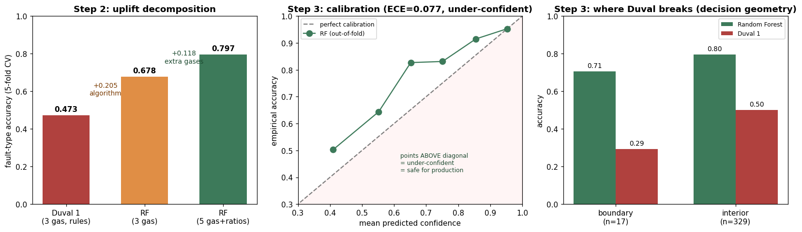

# Hierarchical DGA Transformer Fault Diagnosis — with tested boundaries

[](https://doi.org/10.5281/zenodo.20766195)

Dissolved Gas Analysis (DGA) fault diagnosis that pairs the physical Duval Triangle 1
baseline with a machine-learning classifier, and **measures exactly where each one breaks**.
The contribution is not "ML beats Duval" — it is a decomposed, calibrated, stress-tested
comparison where every number is reproducible and every claim is bounded.



## Executive summary

A power transformer's first diagnostic question is *"is this safe or failing?"*, only then
*"what kind of fault?"*. So the pipeline is hierarchical:

- **Phase 1 — Normal vs Fault:** trivially separable. Healthy units sit at ~35 ppm total gas
  (90th percentile 38), faults at 490 ppm median (10th percentile 80). No overlap — a simple
  threshold suffices. This is the high-reliability screening stage.
- **Phase 2 — fault type (PD / D1 / D2 / T1 / T2 / T3):** the hard part. The exact Duval
  Triangle 1 reaches **47.3%**; a Random Forest using all five gases reaches **80.9%** (macro-F1
  0.77). Crucially, the uplift is *decomposed* (below), not just reported.

The headline finding: ML's advantage comes from reconstructing a high-dimensional decision
surface that the 2-D Duval triangle cannot represent — and that advantage is largest exactly in
Duval's known blind spots (PD, thermal classes).

## Step 1 — correctness gate (exact Duval Triangle 1, IEC 60599)

Before any ML, the physical baseline is verified, not assumed:

- Duval Triangle 1 coded to published mineral-oil boundaries (D1/D2 = 23%, T1/T2 = 20%,
  T2/T3 = 50%, T3 tolerates %C2H2 < 15, DT mixed zone).
- **Verified** to tile the entire triangle (0 uncovered grid points) and to reproduce published
  worked examples.
- Dataset **deduplicated** before any split: 339 duplicate rows removed (2321 → 1982). This
  matters — without it, identical samples leak across train/test and inflate CV accuracy.

Exact Duval baseline on fault rows: **47.3%**. Per-class, it is strong on D1 (0.76) but collapses
on PD (0.14) and thermal classes (T1 0.31, T2 0.40, T3 0.38). This is physically expected:
Triangle 1 uses only 3 of the 5 gases, and Duval built separate Triangles 4 & 5 (with H2 and
C2H6) precisely to resolve these classes.

## Step 2 — uplift, decomposed

Reporting 80.9% alone would be ML hype. The honest question is *how much comes from a better
algorithm vs simply more sensor inputs*:

| classifier | inputs | CV accuracy |
|---|---|---|
| Duval Triangle 1 (rules) | 3 gases | 0.473 |
| Random Forest | 3 gases (same as Duval) | 0.694 |
| Random Forest | 5 gases + ratios | 0.809 |

- **+0.221 from the algorithm alone** (RF learns a flexible boundary on the *same* 3 gases).
- **+0.115 from the extra gases** (H2, C2H6 that Triangle 1 discards).

Two-thirds of the gain is the algorithm, one-third is information. The uplift lands in Duval's
blind spots: PD 0.14 → 0.86, T3 0.38 → 0.94, while D1 (already strong in Duval) barely moves
(0.76 → 0.78). ML adds value where the 3-gas physics is blind, not by "cheating" everywhere.

## Step 3 — calibration & robustness

**Confidence calibration (out-of-fold):** ECE = 0.072, and the model is *under*-confident — every
bin sits above the diagonal (says 65%, is right 79%). High-confidence (≥0.9) error rate is 3.5%.
For a grid asset this is the safe failure mode: the model errs toward "not sure, send a crew,"
not toward confident false reassurance.

**Physical noise stress-test:** multiplicative Gaussian noise on each gas independently, σ scaled
so 3σ = the margin (3σ = 20% ↔ IEEE C57.104 reproducibility), clamped at ≥0. Both methods are
nearly noise-immune up to 50% margin — because DGA classes are macroscopically separated
(concentrations differ by orders of magnitude; multiplicative noise on a log scale rarely crosses
a class boundary).

**Where Duval actually breaks (the real finding):** isolating samples whose Duval zone is unstable
under a tiny wobble (boundary samples) vs stable ones (interior):

| samples | Random Forest | Duval 1 |
|---|---|---|
| boundary (n=17) | 0.77 | 0.29 |
| interior (n=329) | 0.78 | 0.50 |

Duval collapses to 0.29 on boundary samples — *and it does so with or without noise*. The original
hypothesis ("measurement noise erodes Duval's edges") was **tested and rejected**: Duval's
fragility is the rigid geometry of its hand-drawn zones, not sensor precision. RF, as an ensemble,
smooths those edges. For this problem, decision geometry — not measurement error — is the
bottleneck.

## Strict limitations (read before reusing)

- **Labels are NOT inspection-verified ground truth.** This public dataset's labels are most
  likely heuristic (generated by a DGA method), not from physical teardown like the IEC TC10
  database. So RF partly learns *another method's approximation*, and 80.9% is accuracy against
  those labels, not against physical truth.
- **Boundary finding rests on n=17** in the test fold — a strong indication, not proof.
- **Noise model is random, not systematic.** A drifting/failing sensor adds bias, which is worse
  than the zero-mean noise modeled here and would bite harder.
- **Phase-1 cleanliness is dataset-specific;** real field data with marginal/incipient faults
  near the detection threshold would blur the Normal/Fault gap.

## Reproduce

```
pip install -r requirements.txt
python reproduce.py     # downloads data, regenerates every number -> verified_results.json
python make_figs.py     # regenerates fig_results.png
```

Data: `alan-456/transformer-fault-dataset` (data.xlsx, 2321 samples, 7 classes incl. Normal),
itself sourced from Enwen Li (IEEE DataPort) and Duval/dePablo IEC TC10 references.
